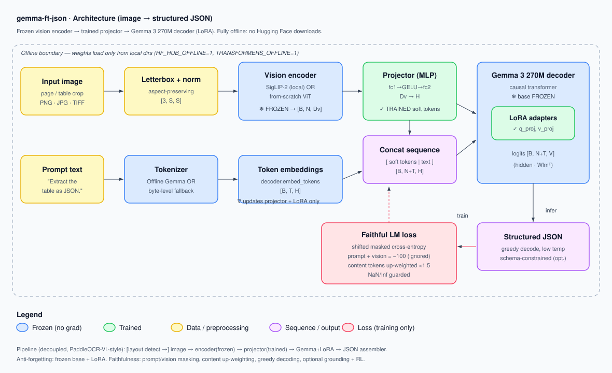

# Architecture & Design Notes



This document explains *what* each component does and *why* it was chosen. It is
the conceptual companion to the code in `src/gemma_ft_json/`.

## 1. The core idea

Gemma 3 270M is a **text-only** language model — it was never trained on pixels.
To make it read table/document images we build a small **Vision-Language Model
(VLM)** in the LLaVA style:

```
image → vision encoder (frozen) → projector (trained) → "soft visual tokens"
                                                              │
prompt text → tokenizer → embeddings ─────────────────────────┤
                                                              ▼
                       concat([soft tokens | text]) → Gemma 3 270M (LoRA) → JSON
```

The 270M decoder contributes a strong **structured-text prior** and a mature
tokenizer; the projector learns to speak the decoder's embedding language; the
encoder supplies visual evidence.

## 2. Why these choices

* **Frozen, contrastively-pretrained vision encoder (SigLIP-2 style).** A ViT is
  the right architecture, but what matters is *pretraining*. A contrastive,
  aspect-ratio-preserving encoder gives document-friendly features. Freezing it
  saves memory and is a primary defense against catastrophic forgetting. When no
  local encoder weights exist, a from-scratch ViT keeps the pipeline runnable.
* **Aspect-ratio-preserving letterbox** input. Tables are wide and grid-aligned;
  squashing to a square shears columns and smears cell borders. We scale the long
  side and pad — preserving geometry.
* **Structured JSON target.** For table-dense data, flattened raw text destroys
  the row/column grid. We train on a single *canonical* JSON serialization
  (sorted keys, compact separators) so the model learns one stable format.
* **LoRA on a frozen base.** Only the projector + low-rank adapters train. This is
  the main anti-forgetting mechanism and keeps optimizer state tiny (MPS-friendly).
* **Faithful loss shaping.** The objective is next-token cross-entropy, but
  *shaped*: the prompt and visual positions are masked (`-100`), and content/value
  tokens are up-weighted over JSON scaffolding (`{ } [ ] : , "`), so the model is
  graded mostly on the data it must copy from the image rather than on punctuation.
* **Greedy decoding.** Sampling amplifies hallucination; extraction wants the most
  probable, evidence-grounded token. Schema-constrained decoding can be layered on.
* **Decoupled layout vs. recognition.** Following the PaddleOCR-VL lesson, a
  separate layout step can crop regions before recognition. The encoder/projector/
  decoder split makes that easy to add without touching the core.

## 3. Component data contract (the plug-and-play interface)

| Component | Key API | Shape in → out |
|---|---|---|
| Vision encoder | `forward(pixel_values)` | `[B,3,S,S] → [B,N,Dv]`; exposes `embed_dim` |
| Projector | `forward(feats)` | `[B,N,Dv] → [B,N,H]` |
| Decoder | `embed_tokens`, `forward(inputs_embeds, attention_mask)` | `[B,T] → [B,T,H]`; `[B,T,H] → [B,T,V]`; exposes `hidden_size`, `vocab_size` |
| Tokenizer | `encode/decode`, `pad_id/bos_id/eos_id`, `vocab_size` | text ↔ ids |
| VLM | `forward(pixel_values, input_ids, attention_mask, labels)` | → `{loss, logits, n_vis}` |
| VLM | `generate(pixel_values, prompt_ids, max_new_tokens, eos_id)` | → `list[int]` |

Any encoder or decoder satisfying these contracts can be swapped via YAML — this
is the "fusion with other models" requirement.

## 4. Numerical safety

Shape guards (`check_shape`) sit at every module boundary and finiteness guards
(`assert_finite`) wrap activations, logits, and the loss, so a wiring/shape bug
fails *loudly at its source* instead of silently becoming a NaN. The stub decoder
masks with `finfo.min` (not `-inf`) to avoid NaNs from fully-masked softmax rows;
softmax is computed in a shift-invariant, overflow-safe way; gradients are clipped
and the per-step grad-norm is logged so spikes are visible before they blow up.

## 5. The offline (no-Hugging-Face-download) guarantee

`HF_HUB_OFFLINE=1` and `TRANSFORMERS_OFFLINE=1` are set at package import, before
any `transformers` import. Real Gemma/SigLIP load only with `local_files_only=True`
from a directory you provide; if it's missing we raise `WeightsNotFoundError`
rather than fetch anything. Pure-PyTorch fallbacks (`TinyStubDecoder`,
`FromScratchViT`, `ByteTokenizer`) let the whole pipeline run with zero assets.

## 6. Extension points

* **Grounding / bbox loss.** `n_loc_bins>0` adds `<locNNNN>` tokens; per-word boxes
  from a digital PDF text layer (`extract_boxes_pymupdf`) can supervise them.
* **RL / preference optimization.** Greedy decode + an exact-match or TEDS reward is
  the natural next step for faithfulness; hooks live around the loss and generate.
* **Stricter splits.** `split_manifest` is random; switch to source-grouped splits
  so evaluation uses genuinely unseen layouts.
* **Production decoding.** Swap the reference (no-KV-cache) generate loop for the
  local HF model's cached `.generate` on `LocalGemmaDecoder`.
